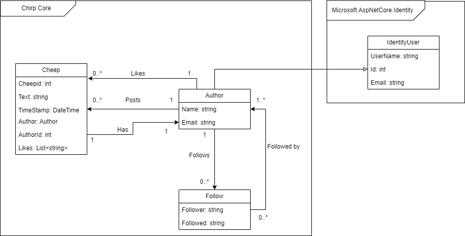
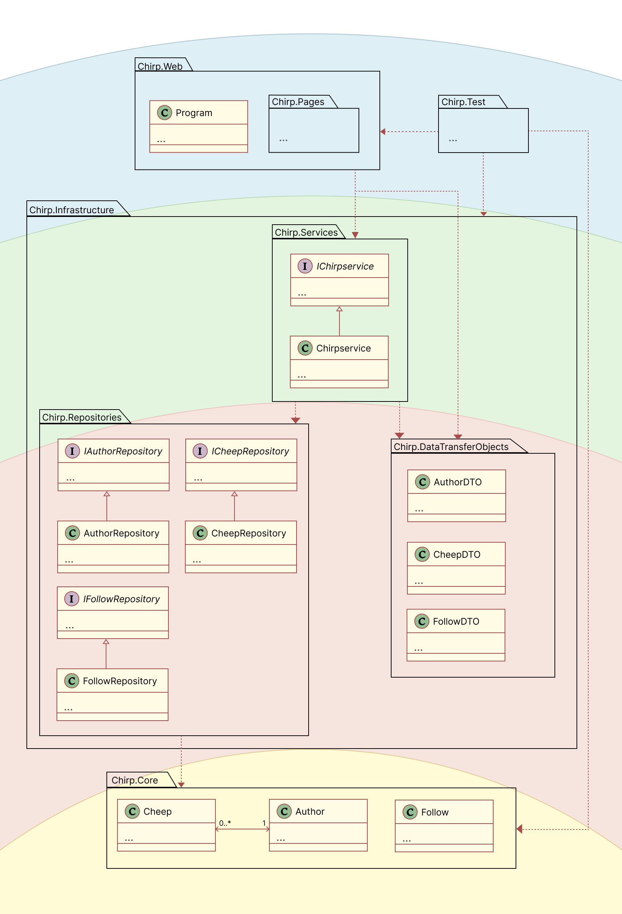
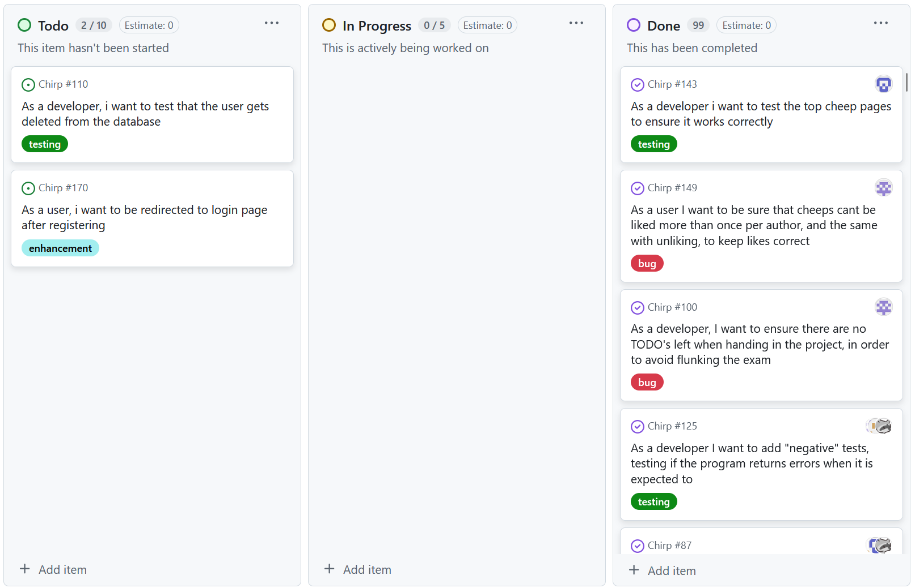

# Introduction
Link to repository https://github.com/ITU-BDSA2024-GROUP15/Chirp


# Design and architecture


## Domain model
The domain model for our Chirp application consists of the classes Cheep, Author, Follow and the relations between them, can be seen in the figure below. 



## Architecture — In the small
Our onion architecture is composed of 4 layers. The innermost layer consists of our domain model. In the second layer we have our repositories, which are responsible for interacting directly with the data model, along with our Data Transfer Objects. The third layer is the service layer, which translates the data output by the repositories into DTOs, so that it may be used on the fourth and outermost web layer. The fourth layer also contains our tests.



## Architecture of deployed application

## User activities

## Sequence of functionality/calls through Chirp!

The sequence of calls that happens through Chirp when an unauthorized user/author tries to access the root endpoint “/” can be seen in the sequence diagram (figure):
````mermaid
sequenceDiagram
  participant Client as :Client
  participant Chirp as Chirp:Public.cshtml.cs
  participant ChirpService as Chirp:ChirpService
  participant cheepRepo as Chirp:CheepRepository
  participant followRepo as Chirp:FollowRepository
  participant db as Chirp:MySQL Database


  Client ->>+ Chirp: 1. GET ("/")
  Chirp ->> Chirp: 1.1 Check for author name
  Chirp ->> Chirp: 1.2 HandlePageNumber()
  Chirp ->>+ ChirpService: 1.3 GetCheeps(pageNumber, authorName?)
  ChirpService->>+cheepRepo: 1.4 GetCheeps(pageNumber)
  cheepRepo->>+db: QUERY: 1.5 Cheeps
  db-->>-cheepRepo: RESULT: 1.6 Cheep OBJECTS
  cheepRepo-->>-ChirpService: 1.7 List<Cheep>
  ChirpService ->> ChirpService: 1.8 ConvertToCheepDTO
  ChirpService->>+followRepo: 1.9 GetFollowed(authorname)
  followRepo->>+db: QUERY: 1.10 Follows
  db -->>- followRepo: 1.6 RESULT: 1.11 Follow OBJECTS
  followRepo -->>-ChirpService: 1.12 List<Follow>
  ChirpService -->>- Chirp: 1.13 List<CheepDTO>
  Chirp ->> Chirp: 1.14 Is User Authenticated
  Chirp -->>- Client: 1.15 RESPONSE: PageResult
````
It should be noted that:
1. We check if the user author name exists in 1.1. This determines which GetCheeps methods should be called. This is our first “check” to see if a user/author is logged in, but this is also checked using identity when the html is rendered in Public.cshtml.
2. The method ConvertToCheepDTO calls GetFollowed.

# Process
## Build, test, release, and deployment

## Teamwork
Show a screenshot of your project board right before hand-in. 


#### Unresolved Tasks
Briefly describe which tasks are still unresolved, i.e., which features are missing from your applications or which functionality is incomplete.


````mermaid
---
config:
  theme: mc
  look: classic
---
flowchart TD
    Issue(Issue created) --> Assign(Developers are assigned)
    Assign --> Branch(New branch created)
    Branch --> Work(Developers work on issue)
    Work --> Acceptance{Acceptance criteria met}
    Acceptance --> |No| Work
    Acceptance --> |Yes| Pull(Pull request is created)
    Pull --> Tests(Tests are run automatically)
    Pull --> Review(Other Developers review request)
    Tests --> PullAccept{Checks pass}
    Review --> PullAccept
    PullAccept --> |No| Work
    PullAccept --> |Yes| Merge(Branch is merged)
    Merge --> Complete(Issue is marked as complete)
    Complete --> Delete(Branch is deleted)

````
## How to make Chirp! work locally

## How to run test suite locally

# Ethics
## License
We have chosen the MIT-license

## LLMs, ChatGPT, CoPilot, and others
We used ChatGPT and BING-CoPilot as a “secondary TA”, by having it explain possible reasons for us getting a particular error or explaining concepts we didn’t understand fully. We mostly used it for explaining complicated stack traces, or finding errors in a code snippet, but no prompt was ever given to the LLMs for generating the code from scratch.

The responses we got were mostly helpful and hastened our process of understanding our code and concept we were uncertain on. Sometimes, the answer we got was not entirely true, or had some faults, but those could be ironed out. Since the LLMs decreased the amount of time we needed for understanding key concepts, it helped us get to the code part faster and faster handling of errors, than if we had decided not to use it. 
