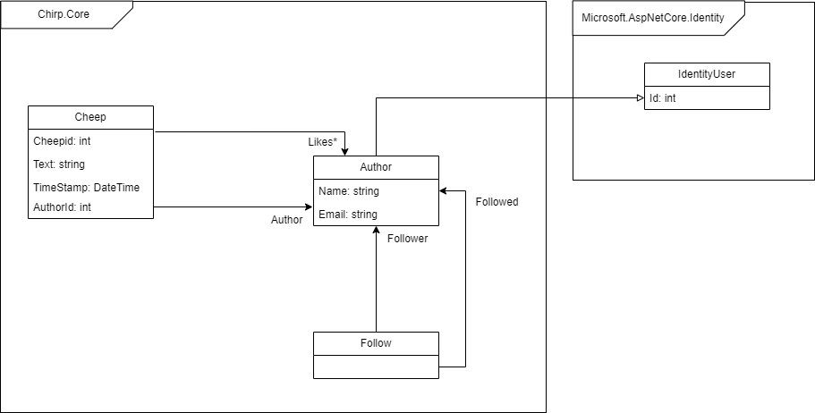

---
geometry:
    - top=1.5cm 
    - bottom=1.5cm 
    - left=1.5cm 
    - right=1.5cm
---

# Introduction
Link to repository https://github.com/ITU-BDSA2024-GROUP15/Chirp

# Design and architecture

## Domain model
The domain model for our Chirp application consists of the classes Cheep, Author, Follow and the relations between them. Author inherits from Microsoft.AspNetCore.Identity's IdentityUser. \
 \
*Illustration of our domain model*

## Architecture — In the small
The Chirp architecture is using the onion architecture which is composed of 4 layers. The innermost layer consists of our domain model. In the second layer we have our repositories, which are responsible for interacting directly with the data model, along with our Data Transfer Objects. The third layer is the service layer, which translates the data output by the repositories into DTOs, so that it may be used on the fourth and outermost web layer. The fourth layer also contains our tests.

 \
*Illustration of our architecture*

## Architecture of deployed application 
The Chirp! application is hosted on Azure. Clients may interact with the app by HTTPS through the razor pages in the Chirp.Web package. The server itself communicates with github servers in order to facilitate github authentication using OAuth. \
 \
*Illustration of our deployed Chirp application*

## User activities
A

## Sequence of functionality/calls through Chirp!

The sequence of calls that happens through Chirp when an unauthorized user/author tries to access the root endpoint “/” can be seen in the sequence diagram: \
 \
*Illustration of flow of communication in Chirp, when call to the endpoint `/` is made*

It should be noted that:
1. We check if the user author name exists in 1.1. This determines which GetCheeps methods should be called. This is our first “check” to see if a user/author is logged in, but this is also checked using identity when the html is rendered in Public.cshtml. \
2. The method ConvertToCheepDTO calls GetFollowed.

# Process
## Build, test, release, and deployment
The chirp application is built, tested, released and deployed using three different GitHub Workflows. The build & test workflow is triggered by any pushes or pull requests to main. This ensures that any code pulled to main can be build and passes all test.

The release workflow builds, tests and then makes a release if previous built and test passes and a commit contains a tag on the form `v*.*.*`. The release contains a windows, linux and macOS version of the application.

We also have a workflow for converting our report.md-file to PDF-file, which we have chosen to exclude from the figure below. 

The deployment workflow builds, tests and deploys the Chirp application to azure.

 \
*Illustration of how we build, test, release and deploy Chirp!*

## Teamwork
 \
*Image of our project board*

### Unresolved Tasks
**110:** This task has been mostly resolved. We have created unit tests which test each part of the deletion process, as well as a UI-tests for this functionality, but we wanted to find a way to test all parts of the process at once, including the part which comes with the identity package, directly on the database.

**170:** We wanted to change our razor pages to redirect directly to the login page after registering, rather than redirecting to the public timeline. This is a very easy thing to fix, but it would break most of our playwright tests, and we therefore chose to put it off for now.

### Flow of tasks
The following flowchart shows the activities that happen from the creation of a task until its deletion. \
 \
*Illustration of the flow of tasks*

## How to make Chirp! work locally
Dotnet 8 and Git is needed to run this project locally.

**Step 1:** Clone the repository by opening a terminal and executing the following command in a folder of your choice:
*`"git clone https://github.com/ITU-BDSA2024-GROUP15/Chirp.git"`*

**Step 2:** Start the Jetbrains Rider application. Make sure you open the project by choosing chirp.sln from the cloned the repository. \

**Step 3:** Open the terminal in Rider. In the terminal, write the command cd *`".\src\Chirp.Web\"`*

**Step 4:** Set the correct user secrets by executing the 2 following commands one by one in the terminal:

*`"dotnet user-secrets set "authentication:github:clientId" "Ov23likvwJ8LuwxPP70k"`*

*`"dotnet user-secrets set "authentication:github:clientSecret" "39d79a4303bb6a707700bab54de74d3f37f64196"`*

After each command, the terminal should write something like: successfully saved [...] to the secret store.

**Step 5:** You should now be set to run the program. Run the program by executing the command *`"dotnet run"`* in the terminal.

**Step 6:** The command should take a little time to finish. When it’s done, the terminal should display something like this:

Copy the localhost link from the terminal into a browser (preferably firefox for the best experience). The browser should now display our site, as seen in the picture below.

## How to run test suite locally
In the application there are three different kind of tests:
Unit tests
Integration test
End to end test / UI test
Unit tests focus on individual methods and their functionality in our repositories and Chirp service. In our unit test we often had to call another method to setup the test, meaning to keep it being a unit test and not an integration test, we ensured that the call to setup was on a sublayer. If we are testing AddCheep in CheepRepository, we would check if the cheep is added using a direct query on our CheepDbContext.
The integration tests test different parts / methods as a group and their interaction between each other.

The end to end tests are used to test entire user journeys. This ensures that our different components, repositories and services work together in union. Using playwright also tests how the user interacts with our application though the browser.

All tests are made to easier catch bugs and errors that may occur when changes are made.

### To run the Unit and Integration tests: 
**Step 1:** Open the terminal, find the project folder and navigate to *`"test\Chirp.Web.Tests"`* \
**Step 2:** Run the command “*dotnet test*”

### To run the end to end test / playwright test:
**If playwright is not installed:** Follow the steps on the [offical website](https://playwright.dev/docs/intro) to install it \
**Step 1:** Open the terminal, find the project folder and navigate to *`“Chirp\src\Chirp.Web`* \
**Step 2:** Run the command *`“dotnet run”`* \
**Step 3:** Ensure you are not logged in on the application \
**Step 4:** Open a new terminal window, find the project folder and navigate to *`"test\PlaywrightTests"`*  \
**Step 5:** Run the command *`“dotnet test”`*

# Ethics
## License
We have chosen the MIT-license. This is in line with the packages we have used in the project. 
To see the full licence agreement go to: https://github.com/ITU-BDSA2024-GROUP15/Chirp/blob/main/LICENSE

## LLMs, ChatGPT, CoPilot, and others
We used ChatGPT and BING-CoPilot as a “secondary TA”.  We mostly used them for explaining complicated stack traces, or finding errors in a code snippet, for understanding concepts we didn't understand and for guidance when setting up our different workflows for GitHub actions.

The responses we got were mostly helpful and hastened our process of understanding our code and concept we were uncertain on. Sometimes, the answer we got was not entirely true, or had some flaws, but we could iron those out. Since the LLMs decreased the amount of time we needed for understanding key concepts, it helped us get to the code part faster and faster handling of errors, than if we had decided not to use it. 
